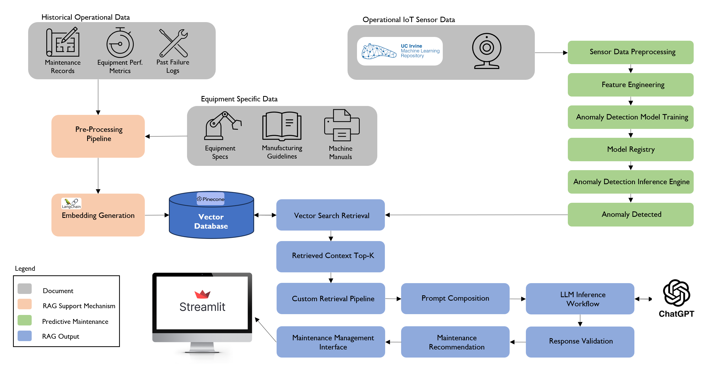

# RAG-PredictiveMaintenance

**Retrieval-Augmented Generation (RAG) chatbot and predictive-maintenance prototype**  
Combines a gradient-boosting fault-classifier with a Streamlit chatbot that retrieves maintenance documentation and generates step-by-step repair guidance—complete with source citations.

<p align="center">
  
</p>

---

## ✨ Features
| Layer | Highlights |
|-------|------------|
| **Algorithm (`1-algorithm/`)** | • Gradient-Boosting model trained on AI4I-2020<br>• Notebook shows EDA, class-imbalance handling (SMOTE), hyper-parameter search<br>• Pickled best model (`best_gradient_boosting_model.pkl`) ready for inference |
| **RAG Pipeline (`2-rag/`)** | • LangChain + OpenAI embeddings + Pinecone vector DB<br>• `indexing.py` ingests maintenance PDFs/Markdown, splits into 500-token chunks, and stores vectors<br>• `retrieval.py` exposes a simple `query_rag()` function |
| **Streamlit App (`3-streamlit/`)** | • Multi-page UI (Dashboard → Failure Classifier → Chatbot)<br>• Real-time confidence visualisation (bar chart)<br>• Chatbot returns grounded answers with numbered citations |
| **Evaluation (`eval/`)** | • Latency benchmark script + raw CSV + histogram<br>• Retrieval quality stub (`retrieval_eval.py`) |
| **Dev Ops** | • `.env.example` with required keys<br>• `requirements.txt` pinned to exact versions |

---

## 🚀 Quick-start

### 1. Clone & set up environment
```bash
git clone https://github.com/JakobBullinger/RAG-PredictiveMaintenance.git
cd RAG-PredictiveMaintenance
python -m venv .venv && source .venv/bin/activate      # Windows: .venv\Scripts\activate
pip install -r requirements.txt
